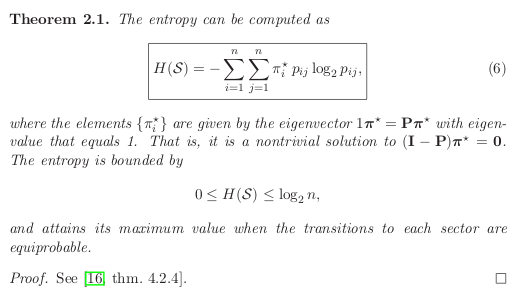
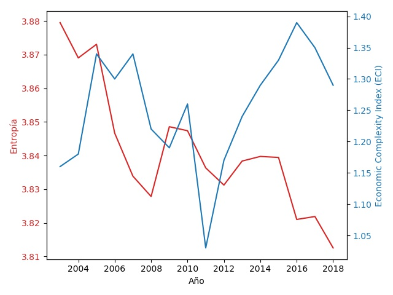

# Entropía en Matrices de Insumo-Producto

Se calcula la entropía de las matrices de insumo producto anuales a precios constantes de 2013 en base a la metodología de Zachariah y Cockshott [(Leontief Meets Shannon - Measuring the Complexity of the Economic System)
](https://arxiv.org/abs/1705.02154) .

La entropía puede ser calculada con la siguiente expresión:

 


Con dicha expresión calculamos la entropía con las matrices anuales de insumo-producto que recientemente fueron puestas al público. Comparamos los resultados con el Economic Complexity Index (ECI) del Growth Lab de Harvard. En dicho índice los países aumentan el ECI al aumentar el número y complejidad de los productos que exportan.

 

Para el periodo 2003-2011, ambos indicadores muestran una caida sostenida. El ECI presenta un incremento para el periodo 2012-2016, mientras que la entropía muestra una mejoría para 2013-2015. Ambos indicadores muestran una caída para 2017 y 2018.

La entropía muestra una caída sostenida para todo el periodo. Los autores comentan que caídas así podrían explicarse por el declive de la industria manufacturera. Hay evidencia sobre una prematura desindustrialización de la economía mexicana, la cual se traduce en bajo crecimiento [(Cruz, 2015)](https://academic.oup.com/cje/article-abstract/39/1/113/2875640?redirectedFrom=fulltext) . 

### Ejecutar
```
python mip_leontief_shannon.py
```

